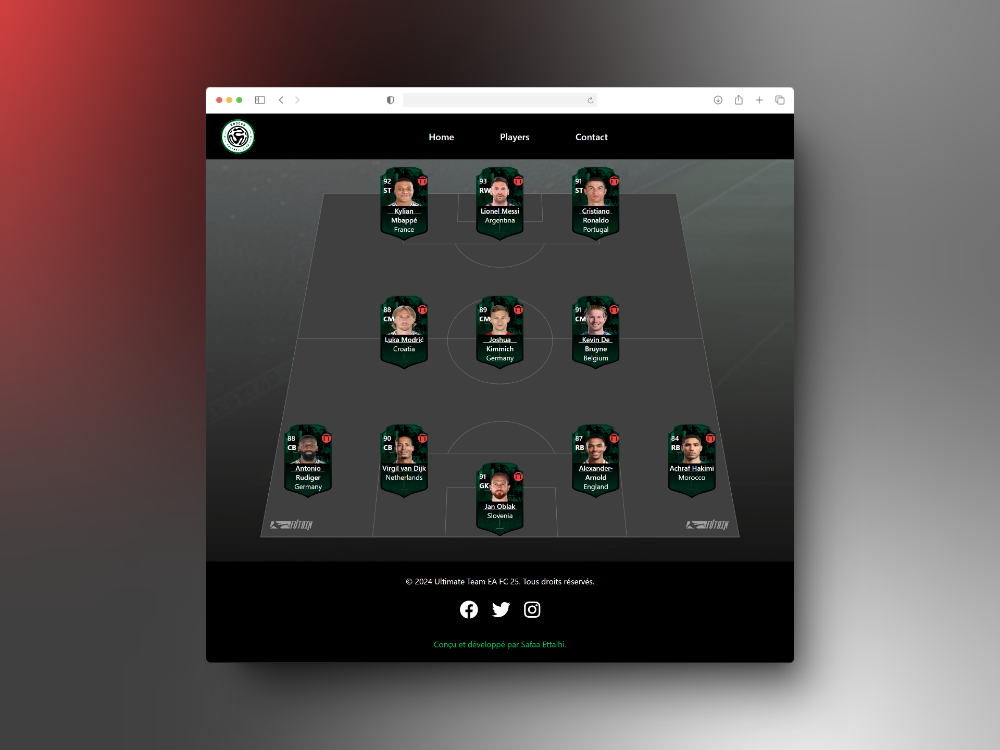

# Ultimate Team Manager - EA FC 25

 


Une application interactive pour créer, personnaliser et gérer une équipe FUT (Ultimate Team). L'accent est mis sur une interface utilisateur dynamique, la gestion des données via `localStorage` et une expérience immersive pour les utilisateurs. 

## 🚀 Fonctionnalités Clés

### 1. **Création et Gestion de Joueurs**
- Formulaire permettant l'ajout de joueurs avec des champs pour : 
  - Nom
  - Position
  - Note
  - Statistiques et autres détails pertinents
- Ajout,et suppression des joueurs via une interface conviviale.

### 2. **Positionnement selon la Formation Tactique**
- Respect des formations prédéfinies (`4-3-3`).
- Placement automatique des joueurs dans des postes adaptés (e.g., `LWF`, `CF`, `AMF`).
- Gestion stricte du maximum de **11 joueurs sur le terrain**, avec des réserves disponibles.
- Placement automatique des joueurs selon la formation.

### 3. **Validation des Formulaires**
- Vérification stricte des champs (nom, position, statistiques).
- Validation native HTML5 et logique JavaScript pour garantir la cohérence.

### 4. **Sauvegarde et Chargement des Données**
- Utilisation de `localStorage` pour :
  - Sauvegarde automatique des formations et joueurs.
  - Récupération des données sauvegardées au chargement de l'application.

### 5. **Responsive Design**
- Adaptation aux tailles d’écran (responsive design).

## 🛠️ Technologies Requises
- **HTML**:-Structure de l'application.
- **CSS** (Framework Tailwind):-Styles de l'interface et gestion du design responsive.
- **JavaScript Vanilla** (DOM natif):-Gestion des interactions dynamiques avec le DOM.
- **JSON** :- Format pour stocker et charger les données des joueurs.

## 📚 User Stories

### 1. **Création d'une Équipe**
- **En tant qu'utilisateur**,  je souhaite ajouter jusqu'à 11 joueurs à ma formation via un formulaire dynamique.
- Critères d'acceptation :
  - Ajout, modification et suppression de joueurs.
  - Validation des champs du formulaire.

### 2. **Sauvegarde et Récupération des Données**
- **En tant qu'utilisateur**,je souhaite que mes données soient sauvegardées automatiquement et récupérées au chargement de l'application.

### 3. ** Responsive Design**
- **En tant qu'utilisateur**,  je souhaite que l'application soit utilisable sur différents appareils

### 4. **Formulaire Dynamique**
- **En tant qu'utilisateur**, je souhaite ajouter ou modifier des joueurs directement via l'interface.
- Critères d'acceptation :
  - Interface ajustée pour un nombre dynamique de joueurs.

## 📦 Installation

1. Clonez le dépôt :
   ```bash
   git clone https://github.com/Safaa-Ettalhi/Copie-de-FUT-Champions
